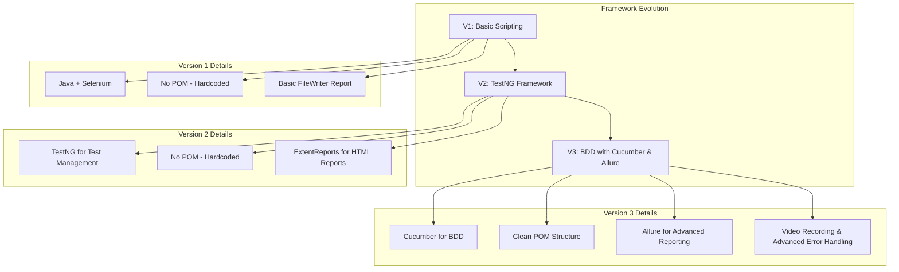

# DEPI Graduation Project - Software Testing Portfolio

This repository contains the graduation project for Group 3 of the DEPI program. It showcases a comprehensive portfolio of software testing skills, including manual testing, API testing, and a three-stage evolution of a UI test automation framework.

## 🌟 Team Members

- **Mohamed Ahmed Gomaa**
- **Shahenda Magdy Abdelrhman**
- **Mariam Adel Ramdan**
- **Nesrin Fathy Farag**
- **Sara Maher Mostafa**

## 🚀 Project Overview

This project demonstrates a wide range of testing methodologies and tools applied to different web applications. The portfolio is structured into three main areas:

1.  **Manual Testing:** Detailed test case suites for **OpenCart** and **DemoBlaze** e-commerce websites.
2.  **API Testing:** A Postman collection for testing the **Simple Books API**.
3.  **UI Automation:** A series of three projects for the **DemoBlaze** website, illustrating the progression from a basic automation script to a sophisticated BDD framework with advanced reporting.

## 🛠️ Technology Stack

| Category          | Technologies                                                                                             |
| ----------------- | -------------------------------------------------------------------------------------------------------- |
| **Languages**     | `Java`                                                                                                   |
| **UI Automation** | `Selenium WebDriver`                                                                                     |
| **Testing Frameworks**| `TestNG`, `Cucumber (BDD)`                                                                               |
| **Build Tool**    | `Maven`                                                                                                  |
| **Reporting**     | `ExtentReports`, `Allure Framework`                                                                      |
| **API Testing**   | `Postman`                                                                                                |
| **Utilities**     | `JavaFaker` (Test Data), `Log4j2` (Logging)                                                              |

## 📂 Project Structure

```
DEPI_GRADUTION_PROJECT/
│
├───📁 Api/
│   └─── Simple Books API DEPI Final.postman_collection.json
│
├───📁 Automation-Demoblaze-V1-No-FrameWork-FileWriterReport/
│   └─── A basic Selenium project with simple file-based reporting.
│
├───📁 Automation-Demoblaze-V2-TestNG-Framework-ExtentReport/
│   └─── A more structured project using TestNG and ExtentReports.
│
├───📁 Automation-Demoblaze-V3-Cucumber-AllureReporting/
│   └─── An advanced BDD framework with Cucumber and Allure reporting.
│
├───📁 Manual - Demoblaze/
│   └─── Test cases and summary reports for the DemoBlaze website.
│
└───📁 Manual - Opencart/
    └─── Manual test cases for the OpenCart website.
```

## 🧪 Testing Portfolio

### 1. Manual Testing

This section includes comprehensive manual test suites for two e-commerce platforms.

-   **DemoBlaze:** 77 test cases covering all major functionalities, including user authentication, product management, and order processing. The results are documented in `DemoBlaze_TestCases_Results.xlsx`.
-   **OpenCart:** A suite of manual test cases for the OpenCart demo website, documented in `ManualProject.txt`.

### 2. API Testing

API testing was performed on the "Simple Books API" using Postman. The collection includes requests for:

-   User registration
-   API authentication (retrieving a token)
-   Creating, updating, and deleting book orders

The Postman collection can be found at `Api/Simple Books API DEPI Final.postman_collection.json`.

### 3. UI Test Automation

This is the core of the project, demonstrating the evolution of a test automation framework through three versions.

#### Automation Framework Evolution



-   **Version 1: No Framework (Basic)**
    -   **Description:** A simple Selenium project that uses basic `FileWriter` to generate `.txt` reports. This version establishes the initial automation scripts. The structure is **hardcoded** and **does not use a design pattern** like the Page Object Model (POM).
    -   **Location:** `Automation-Demoblaze-V1-No-FrameWork-FileWriterReport/`

-   **Version 2: TestNG Framework**
    -   **Description:** This version introduces the TestNG framework for better test management, assertions, and reporting. It also utilizes `ExtentReports` to generate more structured and visually appealing HTML reports. Similar to V1, this version is **hardcoded** and **does not follow the POM design pattern**.
    -   **Location:** `Automation-Demoblaze-V2-TestNG-Framework-ExtentReport/`

-   **Version 3: Cucumber & Allure Reporting**
    -   **Description:** The most advanced version of the framework, which is built with a **clean architecture** and implements the **Page Object Model (POM) design pattern**. It integrates Cucumber for Behavior-Driven Development (BDD), allowing tests to be written in a human-readable Gherkin syntax. Reporting is handled by the Allure Framework, which provides rich, interactive, and detailed test reports.
    -   **Location:** `Automation-Demoblaze-V3-Cucumber-AllureReporting/`

## 🏁 How to Run the Tests

### Prerequisites

-   Java JDK 11 or higher
-   Maven
-   A compatible web browser (e.g., Chrome)

### Running the Automation Tests

Navigate to the directory of the desired automation version and use the following Maven commands:

**For V1 and V2:**

```bash
# Navigate to the project directory
cd Automation-Demoblaze-V1-No-FrameWork-FileWriterReport
# or
cd Automation-Demoblaze-V2-TestNG-Framework-ExtentReport

# Run the tests
mvn clean test
```

**For V3 (Cucumber & Allure):**

```bash
# Navigate to the project directory
cd Automation-Demoblaze-V3-Cucumber-AllureReporting

# Run all tests
mvn clean test

# Run a specific test suite (e.g., smoke tests)
mvn test -Dtest=SmokeTestRunner

# Run tests by feature tags
mvn test -Dcucumber.filter.tags="@signup"
```

## 📊 Reporting

-   **V1 Reports:** Basic `.txt` files located in the `Reports/` directory.
-   **V2 Reports:** HTML reports generated by ExtentReports, located in the `Reports/` directory.
-   **V3 Reports:**
    -   **Cucumber Reports:** Basic HTML reports in `target/cucumber-reports/`.
    -   **Allure Reports:** To generate and view the advanced Allure report, run the following command after the tests have finished:
        ```bash
        mvn allure:serve
        ```
        This will generate the report and open it in your browser.
